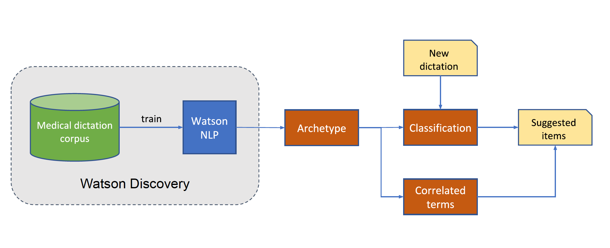

# Discover archetypes in your text corpus using Watson Natural Language Understanding

 
In this code pattern, we will use Watson Discovery and Natural Language Understanding to discover archetypes in your text corpus. 
Archetypes are repeating patterns that may exist in a collection of records and may represent useful information.  

## Flow

## Included components

* Watson Discovery
* Watson Natural Language Understanding

## Featured technologies

# Watch the Video

# Steps

## 1. Clone the repo

## 2. Create the Watson services (Ton)

## 3. Ingest data into Watson Discovery (Ton)

## 4. Discovery the archetypes (David)

## 5. Label the archetypes (David)

## 6. Classify a new dictation (David)

## 7. Use the relevant terms (David, Ton)

